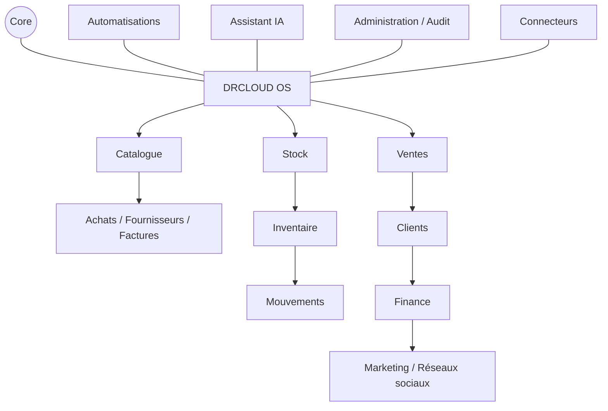
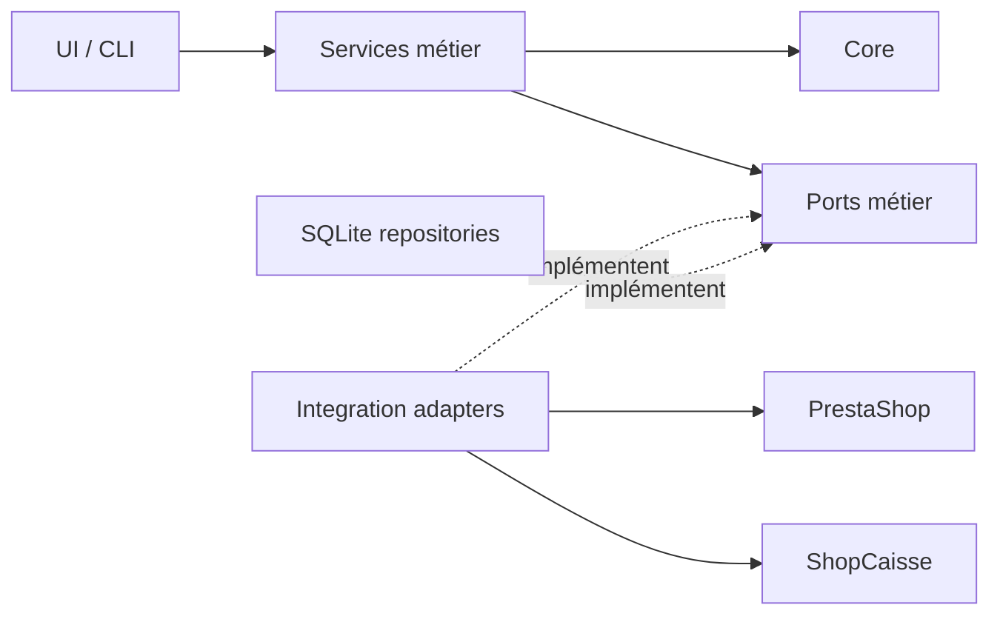
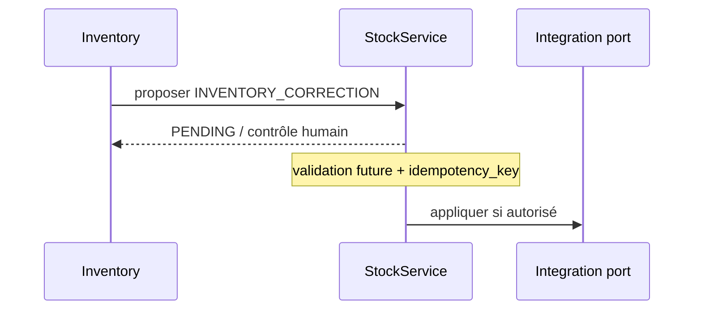

# Plan directeur d'architecture DrCloud OS

**Statut :** cible évolutive — monolithe modulaire. **Date :** 2026-07-29.

## Vision et principes

DrCloud OS devient le système central : PrestaShop et ShopCaisse sont des systèmes connectés, jamais les propriétaires implicites du métier. Les modules sont des frontières internes d'une même application, pas des applications autonomes.

Principes : identité DrCloud stable, services métier comme point d'entrée, dépendances dirigées, validation humaine pour les effets sensibles, opérations reprenables et idempotentes. SQLite et un bus local synchrone/persisté suffisent aujourd'hui. Aucun Kafka, Kubernetes, microservice, event sourcing complet, CQRS complexe, Redis ou Elasticsearch n'est requis.

## Modules officiels et frontières

### Registre du shell

`src/dr_cloud_sync/modules.py` est la source unique des groupes et entrées de la
sidebar. Pour déclarer un futur domaine, ajouter un `Module` avec son identifiant
Roadmap et sans route, template ni script : il restera non interactif et marqué
« À venir ». Une fois sa fonctionnalité et sa route réellement livrées, renseigner
ensemble `route`, `page_template` et `script` pour l'activer. Le shell génère alors
automatiquement son lien et son état actif ; aucune duplication dans les pages
HTML n'est nécessaire.

Chaque module peut dépendre de **CORE**. Une flèche métier autorisée va vers un service/port public, jamais vers les tables ou le HTTP d'un autre module. **INTEGRATIONS** implémente des ports déclarés par le métier ; le métier ne dépend pas d'un fournisseur.

| Module | Responsabilité et données possédées | Services métier | Événements produits / consommés | Dépendances autorisées et connecteurs |
|---|---|---|---|---|
| **CORE** | Identités transverses, `ActivityLog`, enveloppes d'événements, jobs, notifications, erreurs, clés d'idempotence, exécutions de sync, permissions, audit, configuration | EventDispatcher, JobRunner, NotificationService, IdempotencyService, AuditService | tous événements techniques ; consomme les événements auditables | aucune dépendance métier ; ports stockage/notification |
| **CATALOG** | `DrCloudProduct`, identité et correspondances produit, codes-barres | CatalogService, ProductIdentityService, BarcodeService | `PRODUCT_CREATED`, `PRODUCT_UPDATED`, `BARCODE_ASSIGNED` / imports et sync | CORE ; ports catalogue PrestaShop et ShopCaisse via INTEGRATIONS |
| **INVENTORY** | sessions, comptages physiques, scans, progression, EAN de session, validations et rapprochements | InventoryService, CountingService, InventoryReconciliationService | événements `INVENTORY_*`, `STOCK_MOVEMENT_PROPOSED` / produit et code-barres | CORE, CATALOG, port public STOCK ; aucun connecteur direct |
| **STOCK** | `StockMovement`, ledger et projection de stock permanent | StockService, MovementValidationService, StockProjectionService | `STOCK_MOVEMENT_*`, `STOCK_CHANGED`, `STOCK_LOW` / propositions inventaire, réception, vente, retour | CORE, CATALOG ; ports de stock via INTEGRATIONS |
| **PURCHASING** | `Supplier`, `SupplierDocument`, `Purchase`, `PurchaseLine`, `GoodsReceipt`, `GoodsReceiptLine` | PurchasingService, DocumentMatchingService, GoodsReceiptService | `SUPPLIER_DOCUMENT_IMPORTED`, `GOODS_RECEIPT_VALIDATED`, proposition de mouvement / catalogue | CORE, CATALOG, port STOCK ; OCR/document AI et email via INTEGRATIONS |
| **SALES** | `Sale`, `SaleLine`, `Payment`, `Refund`, `Return`; `external_id`, `source_system`, `idempotency_key` | SalesImportService, RefundService, ReturnService | `SALE_IMPORTED`, `SALE_COMPLETED`, `REFUND_COMPLETED`, propositions SALE/RETURN / catalogue | CORE, CATALOG, port STOCK ; PrestaShop/ShopCaisse/paiements via INTEGRATIONS |
| **CUSTOMERS** | `Customer`, `CustomerIdentity`, `CustomerConsent`; liens prouvés, sans fusion arbitraire | CustomerService, IdentityResolutionService, ConsentService | identité/consentement créé ou modifié / ventes et imports | CORE ; sources clients via ports SALES/INTEGRATIONS |
| **FINANCE** | projections analytiques : CA, coût achat, marge brute, TVA disponible, valeur stock, achats, remboursements, rentabilité | FinanceProjectionService, MarginService | projections actualisées / ventes, remboursements, achats, stock | CORE et événements publics SALES, PURCHASING, STOCK, CATALOG ; aucun connecteur comptable implicite |
| **MARKETING** | `Content`, `Campaign`, `SocialPost`, `SocialAccount`, `ContentCalendar`, `PerformanceMetric` | ContentService, CampaignService, PublishingService | `SOCIAL_POST_PROPOSED/APPROVED/PUBLISHED` / produits, consentements | CORE, CATALOG, CUSTOMERS ; plateformes sociales via INTEGRATIONS |
| **AUTOMATION** | règles, déclencheurs, propositions, exécutions et approbations | AutomationService, RuleEvaluator | événements d'automatisation / événements publics autorisés | CORE et façades publiques ; aucune écriture externe directe |
| **AI_ASSISTANT** | conversations, demandes et propositions READ/PROPOSE/EXECUTE | AssistantService, ToolAuthorizationService | proposition créée/exécution demandée / contexte métier autorisé | CORE, services publics ; jamais les repositories/connecteurs directement |
| **DASHBOARD** | projections en lecture, filtres et préférences d'affichage ; aucune donnée source | DashboardQueryService, RoadmapService | aucun événement métier requis / événements de projection | façades de lecture CORE et modules |
| **ADMIN** | `User`, `Role`, `Permission`, `AuditLog`, `SystemSetting`, `IntegrationCredentialReference` | UserService, AuthorizationService, SettingsService | rôle/configuration modifié / audit | CORE ; coffre de secrets par port sécurisé |
| **INTEGRATIONS** | adaptateurs, curseurs, health status et métadonnées d'appel ; pas de règle métier | PrestaShopConnector, ShopCaisseConnector, futurs Social/Email/OCR/Payment connectors | `SYNC_STARTED/COMPLETED/FAILED` / commandes explicites des services | CORE et interfaces (ports) du métier ; SDK/HTTP externes |

### Direction des dépendances

Interdit : `Inventory → HTTP PrestaShop` depuis l'UI. Autorisé : `Inventory → StockService → port d'intégration → adaptateur PrestaShop`. Pour éviter les cycles, les échanges entre domaines passent par une façade publique ou un événement ; aucune lecture directe des tables voisines.

## Modèles et flux principaux

### Catalogue et identité stable

`DrCloudProduct` porte au minimum `drcloud_product_key`, `prestashop_key`, `product_id`, `combination_id`, `shopcaisse_item_id`, `name`, `ean`, `status`, `created_at`, `updated_at`. La clé DrCloud ne dépend ni du nom, ni de l'EAN, du prix ou du stock. Le mapping certain 478/478 est le socle initial, pas une dépendance permanente à PrestaShop.

### Stock par mouvements

`StockMovement` porte `id`, `drcloud_product_key`, `quantity_delta`, `movement_type`, `source_type`, `source_id`, `idempotency_key`, `created_at`, `validated_at`, `status`. Types initiaux : `INVENTORY_CORRECTION`, `SUPPLIER_RECEIPT`, `SALE`, `RETURN`, `LOSS`, `MANUAL_ADJUSTMENT`. Une contrainte unique sur `idempotency_key` empêche la double application. Le ledger est append-only fonctionnellement ; une correction produit un nouveau mouvement. Aucun mouvement réel n'est activé par ce plan.

Inventory reste propriétaire du comptage et propose la correction ; Stock décide et possède le stock permanent.

### Achats

`facture/BL → extraction → rapprochement catalogue → contrôle humain → réception → validation → proposition SUPPLIER_RECEIPT`. Les données conservées incluent fournisseur, document source, EAN, produit, quantité, prix d'achat, TVA si disponible, dates et statut de rapprochement. L'OCR complet est différé.

### Ventes et retours

Les imports ShopCaisse/PrestaShop sont normalisés vers Sale, SaleLine et Payment. Une vente ou un retour validé propose respectivement `SALE` ou `RETURN`. Le triplet `source_system`, `external_id`, `idempotency_key` protège les réimports. Refund et Return restent distincts.

### Clients, finance et marketing

Les `CustomerIdentity` sont reliées avec preuve et revue ; aucune fusion automatique incertaine. `CustomerConsent` conditionne les usages marketing. Finance consomme les faits métier et produit des indicateurs, sans prétendre remplacer une comptabilité. Marketing suit `catalogue → sélection → génération → validation humaine → publication → performances`, derrière des ports multi-plateformes.

### Automatisation et assistant

Le moteur local réagit par exemple à `STOCK_LOW`, `GOODS_RECEIPT_VALIDATED`, `PRODUCT_CREATED` ou `SYNC_FAILED`. Une règle marque l'action sensible comme soumise à validation. L'assistant appelle uniquement les services DrCloud OS : « prépare ma commande » appelle `PurchasingService`, crée une proposition, puis attend la validation. Capacités séparées : **READ** (lecture), **PROPOSE** (brouillon), **EXECUTE** (effet autorisé et audité).

Dashboard est une projection : CA, marge, ventes, stock faible/ruptures, valeur stock, réceptions, erreurs sync, tâches et performances marketing restent la propriété de leurs modules sources.

## Catalogue initial d'événements

Enveloppe commune minimale : `event_id`, `event_type`, `occurred_at`, `producer`, `aggregate_id`, `correlation_id`, `schema_version`, `payload`. La livraison locale peut être une table SQLite/outbox et un dispatcher simple ; aucune plateforme distribuée n'est nécessaire.

| Propriétaire | Événements | Payload métier minimal |
|---|---|---|
| CATALOG | `PRODUCT_CREATED`, `PRODUCT_UPDATED` | `drcloud_product_key`, champs modifiés/version |
| CATALOG | `BARCODE_ASSIGNED` | `drcloud_product_key`, `ean`, assignment_id |
| INVENTORY | `INVENTORY_STARTED` | `inventory_id`, started_at |
| INVENTORY | `INVENTORY_COUNTED` | `inventory_id`, `drcloud_product_key`, quantité, source |
| INVENTORY | `INVENTORY_COMPLETED`, `INVENTORY_VALIDATED` | `inventory_id`, totals, validated_by si applicable |
| STOCK | `STOCK_MOVEMENT_PROPOSED`, `STOCK_MOVEMENT_VALIDATED` | movement_id, produit, delta, type, source, idempotency_key |
| STOCK | `STOCK_CHANGED`, `STOCK_LOW` | produit, previous/current quantity, threshold |
| PURCHASING | `SUPPLIER_DOCUMENT_IMPORTED` | document_id, supplier_id, source reference |
| PURCHASING | `GOODS_RECEIPT_VALIDATED` | receipt_id, line ids, validated_by |
| SALES | `SALE_IMPORTED`, `SALE_COMPLETED` | sale_id, source_system, external_id, totals |
| SALES | `REFUND_COMPLETED` | refund_id, sale_id, amount, returned lines |
| INTEGRATIONS | `SYNC_STARTED`, `SYNC_COMPLETED`, `SYNC_FAILED` | sync_id, connector, operation, counts/error_code |
| MARKETING | `SOCIAL_POST_PROPOSED`, `SOCIAL_POST_APPROVED`, `SOCIAL_POST_PUBLISHED` | post_id, account_id/platform alias, actor/publication reference |

## États, reprise et idempotence

États communs : `DRAFT`, `PENDING`, `VALIDATED`, `PROCESSING`, `COMPLETED`, `FAILED`, `SYNC_PENDING`, `CANCELLED`. Chaque agrégat documente ses transitions. Avant un effet, sauvegarder l'intention et sa clé ; après interruption, reprendre les unités non terminées. Une opération externe utilise une clé fournisseur quand disponible, sinon une clé locale unique et une lecture de vérification. Les retries sont bornés et auditables.

## Connecteurs

Chaque adaptateur encapsule authentification, délais, retry avec backoff, rate limits, normalisation des erreurs, idempotence et health status. Les secrets sont résolus côté serveur depuis un gestionnaire/configuration d'environnement au moyen d'`IntegrationCredentialReference`; ils ne figurent ni dans les objets métier, ni dans les logs/payloads, ni dans le navigateur. Connecteurs présents : PrestaShop et ShopCaisse. Extensions prévues : réseaux sociaux, email, OCR/document AI et paiements.

## Sécurité et validation humaine

Permissions cibles : `VIEW`, `CREATE`, `EDIT`, `VALIDATE`, `SYNC`, `ADMIN`, évaluées par ressource et action. Séparer l'auteur du validateur quand le risque l'exige. Toute exécution sensible enregistre acteur, décision, cible, corrélation et résultat dans AuditLog/ActivityLog. Les écritures de stock, publication, synchronisation et usage IA EXECUTE sont refusées par défaut sans permission et état validé.

## Stratégie de données

SQLite reste le stockage transactionnel actuel. Les domaines utilisent repositories/Unit of Work et modèles métier indépendants du SQL : pas de requête SQLite dans l'UI ou les services. Migrations versionnées, contraintes d'unicité, UTC et transactions courtes préparent PostgreSQL. La migration future remplacera les adaptateurs de repository, puis validera types, concurrence, séquences et sauvegarde/restauration ; elle n'est pas réalisée maintenant. Les projections peuvent être reconstruites depuis les données métier et événements conservés, sans adopter un event sourcing complet.
